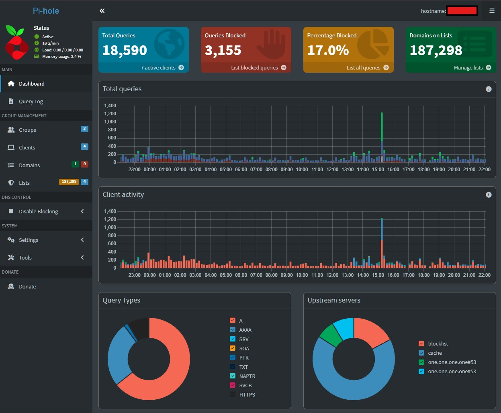
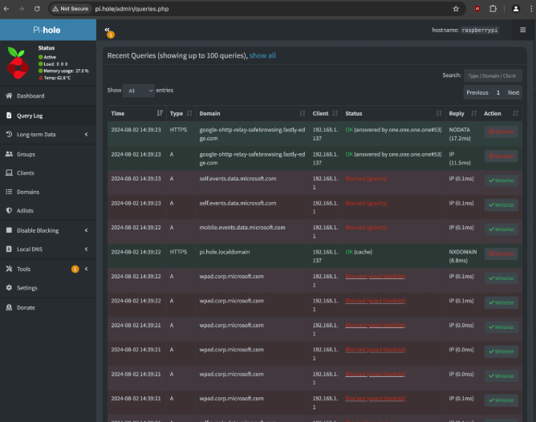

# Raspberry Pi Pi-hole DNS Server

## Overview
This project demonstrates the deployment and configuration of a Raspberry Pi–based Pi-hole DNS server used as the primary DNS resolver for a private LAN.

This system provides network-wide ad blocking, DNS filtering, and improved privacy by controlling outbound DNS queries.

The deployment improves network privacy, reduces unwanted traffic, and centralizes DNS control across multiple LAN clients.

All network identifiers and IP addresses have been sanitized for security.

---

## Architecture

- Device Role: DNS Filtering Server  
- Platform: Raspberry Pi  
- Service: Pi-hole  
- DHCP: Router-managed  
- Network Scope: Private LAN  

---

## System Information

- Operating System: Debian GNU/Linux 13 (Trixie)  
- Kernel: Raspberry Pi Linux Kernel (6.x)  
- CPU Architecture: ARM Cortex-A76  

---

## Network Configuration

- Interface: eth0 (Ethernet)  
- IP Assignment: Static (DHCP reservation via router)  
- DNS Role: Primary resolver for LAN clients  
- Fallback DNS: Router (sanitized)  

---

## Pi-hole Configuration

- Pi-hole Core Version: v6.4  
- Web Interface Version: v6.5  
- FTL Engine Version: v6.6  

### Service Status
- DNS service active on port 53  
- IPv4 and IPv6 enabled  
- Blocking enabled  

---

## Firewall Configuration

- Firewall: UFW (Uncomplicated Firewall)  
- Allowed Ports:
  - 53 (DNS)
  - 80 (HTTP)
  - 443 (HTTPS)
  - 22 (SSH)
  - 123 (NTP)

---

## Storage

- Operating System hosted on NVMe SSD  
- SD card retained for auxiliary storage and backup use  

---

## Deployment Process

### System Update
```bash
sudo apt update && sudo apt upgrade -y
```

---

## Screenshots

### Pi-hole Dashboard Overview
The dashboard displays real-time DNS statistics, including total queries, blocked queries, and client activity across the network.



### DNS Query Activity
The query log demonstrates real-time DNS requests from multiple LAN clients. This confirms that the Pi-hole instance is actively handling and filtering network traffic.



---

## System Validation

### Pi-hole Service Status
The Pi-hole DNS service was verified to be active and handling DNS requests on port 53. Ad-blocking functionality is enabled and operational.

- DNS service running
- Blocking enabled
- FTL engine active

---

### Storage Verification
The system was confirmed to be running from NVMe storage rather than the default SD card.

- Root filesystem mounted on NVMe (`/dev/nvme0n1p2`)
- Filesystem type: ext4
- Mount options optimized for performance (`noatime`)

---

### Verification Commands

```bash
pihole status
lsblk
findmnt /
```


